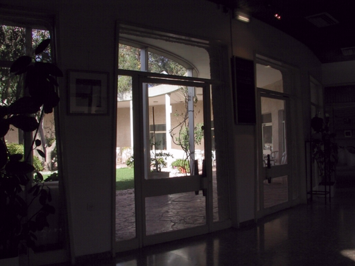
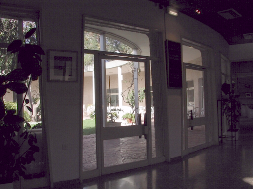

# DIP Homework 2

## Overview
This project provides three image processing functionalities:
1. **Luminosity Enhancement**
2. **Sharpness Enhancement**
3. **Denoise**

All output images are stored in the `output/` directory.

## Files Structure
```sh
|-- inc/               # Header files
|-- input/             # Input images
|-- output/            # Output images (generated after execution)
|-- src/               # Source files
|-- obj/               # Compiled object files (generated during compilation)
|-- LE.cpp             # Luminosity Enhancement implementation
|-- SE.cpp             # Sharpness Enhancement implementation
|-- DN.cpp             # Denoise implementation
|-- Makefile           # Build automation script
|-- hw2_109511207.pdf  # Report for DIP HW2
```

## Prerequisites
- Put all files into an unix-based workstation
- g++ compiler

## Compilation
To compile all source files, run the following command:
```sh
make
```
This will compile all source files and generate three executable files: LE, SE, and DN.

## Execution
### 1. Luminosity Enhancement
To process an image with luminosity enhancement, use:
```sh
make exe_LE
```

### 2. Sharpness Enhancement
To process an image with sharpness enhancement, use:
```sh
make exe_SE
```

### 3. Denoise
To process an image with denoise, use:
```sh
make exe_DN
```

## Clean Up
To remove all compiled object files and generated output images, run:
```sh
make clean
```
This will delete the obj/ and output/ directories as well as the executable files.

## Report
The file [hw2_109511207.pdf](hw2_109511207.pdf) contains the report for DIP Homework 2.

## Results

<table>
  <tr>
    <th colspan="3" style="text-align:center;">Luminosity Enhancement</th>
  </tr>
  <tr>
    <td align="center"><b>Before Enhancement</b></td>
    <td align="center"><b>After Enhancement 1</b></td>
    <td align="center"><b>After Enhancement 2</b></td>
  </tr>
  <tr>
    <td style="text-align:center;"></td>
    <td style="text-align:center;"></td>
    <td style="text-align:center;"></td>
  </tr>
</table>

<table>
  <tr>
    <th colspan="3" style="text-align:center;">Sharpness Enhancement</th>
  </tr>
  <tr>
    <td align="center"><b>Before Enhancement</b></td>
    <td align="center"><b>After Enhancement 1</b></td>
    <td align="center"><b>After Enhancement 2</b></td>
  </tr>
  <tr>
    <td style="text-align:center;"></td>
    <td style="text-align:center;"></td>
    <td style="text-align:center;"></td>
  </tr>
</table>

<table>
  <tr>
    <th colspan="3" style="text-align:center;">Denoise</th>
  </tr>
  <tr>
    <td align="center"><b>Before Denoise</b></td>
    <td align="center"><b>After Denoise 1</b></td>
    <td align="center"><b>After Denoise 2</b></td>
  </tr>
  <tr>
    <td style="text-align:center;"></td>
    <td style="text-align:center;"></td>
    <td style="text-align:center;"></td>
  </tr>
</table>
