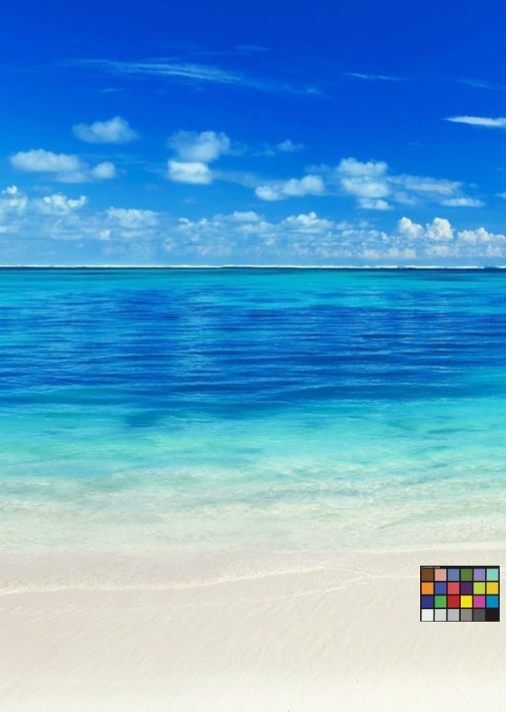
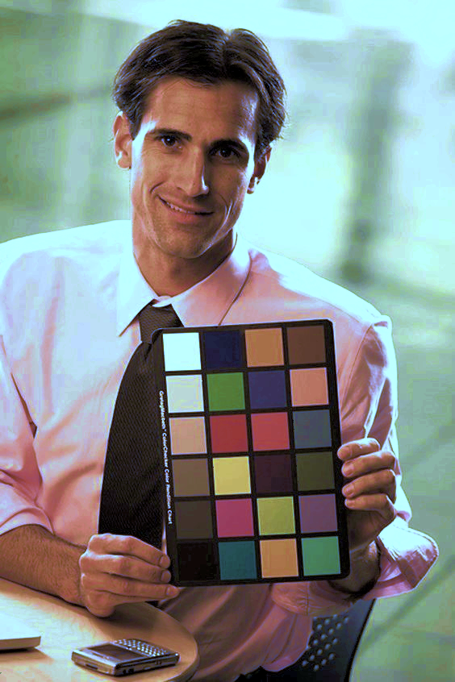
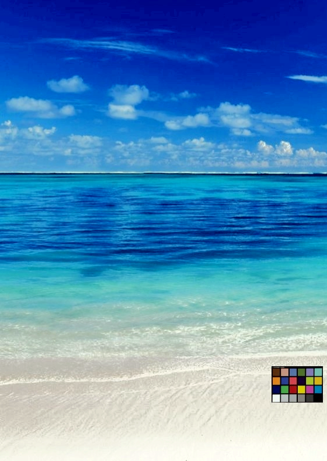

# DIP Homework 3

## Overview
This project provides two image processing functionalities:
1. **Chromatic Adaptation**
2. **Image Enhancement**

All output images are stored in the `output/` directory.

## Files Structure
```sh
|-- inc/               # Header files
|-- src/               # Source files
|-- obj/               # Compiled object files (generated during compilation)
|-- output/            # Output images (generated after execution)
|-- CA.cpp             # Chromatic Adaptation implementation
|-- IE.cpp             # Image Enhancement implementation
|-- Makefile           # Build automation script
|-- hw1_109511207.pdf  # Report for DIP HW1
```

## Prerequisites
- Put all files into an unix-based workstation
- g++ compiler

## Compilation
To compile all source files, run the following command:
```sh
make
```
This will compile all source files and generate three executable files: FLIP, QR, and SCALE.

## Execution
### 1. Chromatic Adaptation
To process an image with chromatic adaptation, use:
```sh
make exe_CA
```

### 2. Image Enhancement
To process an image with image enhancement, use:
```sh
make exe_IE
```

## Clean Up
To remove all compiled object files and generated output images, run:
```sh
make clean
```
This will delete the obj/ and output/ directories as well as the executable files.

## Report
The file [hw3_109511207.pdf](hw3_109511207.pdf) contains the report for DIP Homework 3.

## Results

<table>
  <tr>
    <th></th>
    <th>input1.bmp</th>
    <th>input2.bmp</th>
    <th>input3.bmp</th>
    <th>input4.bmp</th>
  </tr>
  <tr>
    <td style="text-align: center;"><center><b>Original</b></center></td>
    <td></td>
    <td></td>
    <td></td>
    <td></td>
  </tr>
  <tr>
    <td style="text-align: center;"><center><b>Chromatic Adaptation</b></center></td>
    <td></td>
    <td></td>
    <td></td>
    <td></td>
  </tr>
  <tr>
    <td style="text-align: center;"><center><b>Image Enhancement</b></center></td>
    <td></td>
    <td></td>
    <td></td>
    <td></td>
  </tr>
</table>


